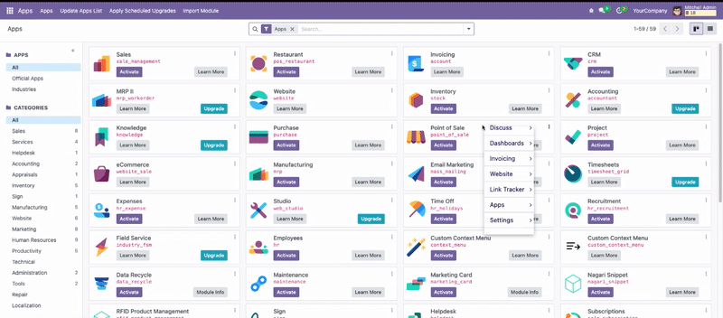

# Custom Context Menu for Odoo

Transform the way you interact with Odoo! This module overrides the default browser context menu, providing a modern, customizable right-click menu tailored for productivity and user experience.

## Key Features
- **Override Default Context Menu:** Replaces the standard browser right-click menu with a fully integrated Odoo menu.
- **Consistent User Experience:** Ensures a unified, professional look and feel across your Odoo environment.
- **Customizable Actions:** Easily extend or modify the context menu to include the actions your users need most.
- **Supports Nested Menus:** Organize actions in parent/child structures for clarity and efficiency.
- **Modern UI:** Built with the latest Odoo frontend technologies for speed and responsiveness.
- **User-level Control:** Each user can enable or disable the custom context menu from their user menu.
- **Easy Installation:** Plug-and-play—no technical expertise required.

## Installation
1. Copy the `custom_context_menu` module to your Odoo `addons` directory.
2. Update the Apps list in Odoo.
3. Install the module from the Apps menu.

## Usage
- **Enable/Disable per User:**
  - Go to your user menu (top right corner in Odoo).
  - Toggle the "Custom Menu" option to enable or disable the custom context menu for your user.
- **Using the Context Menu:**
  - Right-click anywhere in Odoo to open the custom context menu.
  - Access relevant actions, shortcuts, and tools directly from the menu.

## Compatibility
- Odoo 18.0 Community & Enterprise

## Screenshots
- 
- 
- 

## Support & Documentation
- Email: prt.c.bhatti@gmail.com

## License
OPL-1 