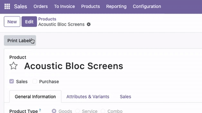
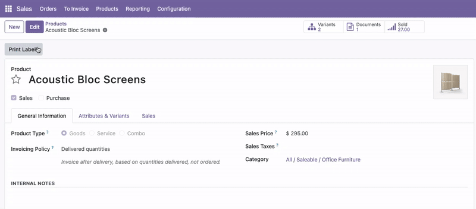

# Form Edit Button Restore for Odoo

Restore the classic Edit/Save workflow in Odoo 18 form views! This module brings back the familiar, user-friendly editing experience from earlier Odoo versions.

## Key Features
- **Classic Edit/Save Workflow:** Form views open in read-only mode by default, just like Odoo 13 and earlier.
- **Edit Button:** An Edit button is shown; Save and Discard buttons are hidden until you enter edit mode.
- **Seamless Transition:** Clicking Edit switches to edit mode, revealing Save and Discard buttons.
- **Automatic Return:** After saving or discarding, the form returns to read-only mode.
- **Global Effect:** Works for all form views across your Odoo instance.
- **No Configuration Needed:** Install and enjoy the classic workflow instantly.

## Installation
1. Copy the `form_edit_button_restore` module to your Odoo `addons` directory.
2. Update the Apps list in Odoo.
3. Install the module from the Apps menu.

## Usage
- Open any form view in Odoo 18.
- The form will open in read-only mode by default.
- Click the **Edit** button to switch to edit mode.
- The **Save** and **Discard** buttons will appear in edit mode.
- After saving or discarding, the form returns to read-only mode.

This workflow is perfect for users who prefer the classic Odoo editing experience and want to avoid accidental changes.

## Compatibility
- Odoo 18.0 Community

## Screenshots
- 
- 

## Support & Documentation
- Email: prt.c.bhatti@gmail.com

## License
OPL-1 