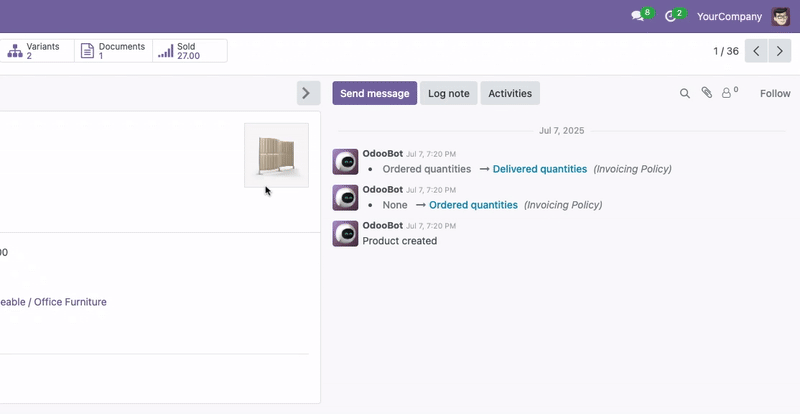

# Form Full Screen / Full Width & Chatter Toggle for Odoo

Enhance your Odoo form view experience, especially on large screens! This module provides a distraction-free, flexible interface with full-width forms and advanced chatter controls.

## Key Features
- **Full Screen / Full Width Form View:** Remove default width restrictions for a more immersive editing experience.
- **Chatter Toggle:** Instantly hide or show the chatter (messages & activities) panel to maximize workspace and focus on form content.
- **Chatter Position:** Toggle the position of the chatter to the side of the form view for better usability on wide monitors.
- **Animated Toggle Button:** Smooth, animated toggle button integrated into the form status bar for easy access.
- **Modern UI:** Clean, professional look with subtle animations.
- **No Configuration Needed:** Install and use immediately.

## Installation
1. Copy the `form_full_screen` module to your Odoo `addons` directory.
2. Update the Apps list in Odoo.
3. Install the module from the Apps menu.

## Usage
- Open any form view in Odoo 18.
- Use the toggle button in the form status bar to:
  - Switch the chatter panel between visible and hidden.
  - Change the position of the chatter to the side for wide screens.
  - Enable full-width (full screen) mode for the form view.
- Enjoy a more flexible, distraction-free interface, ideal for users who work extensively with form views.

## Compatibility
- Odoo 18.0 Community & Enterprise

## Screenshots
- 
- 

## Support & Documentation
- Email: prt.c.bhatti@gmail.com

## License
OPL-1 